<!-- Summary extracted from GummyBearTomography_Final_Report.ipynb: markdown text only; figures under figures/. Optical-simulation figures; M8 LR study; architecture comparisons (pooled/Fourier/flatten) and M8 split sensitivity. -->

# Gummybear Tomography: Particle Localization in Translucent Simulated Phantoms

# 0. Huggingface repository

The checkpoints and the integral optical data from a full run is on Huggingface, at https://huggingface.co/datasets/tbhugging/gummybear-tomography/tree/main


# 1. Problem statement

Many imaging tasks require estimating the three-dimensional position of objects that are embedded within a partially transparent volume while only a limited number of observations are available. This can for instance concern localization of particles or markers in turbid media such as fogs, clouds, emulsions, suspensions, tissues, and hydrogels. The same problem appears in microscopy, biomedical imaging and other domains when only a few views of a translucent volume are available.  

Automated image analysis with the aid of artificial intelligence is increasingly applied to tomographic imaging. In  information-constrained settings, neural networks must infer spatial location from indirect visual cues. However, common convolutional neural network architectures often rely on global pooling operations that improve parameter efficiency at the cost of discarding spatial information. This project investigates whether physically informed spatial-frequency representations can compensate for this loss of spatial information and improve localization accuracy when observational information is scarce, while simultaneously identifying potential costs of using such priors. The aim is to derive design principles for architectures that are both precise and parameter-economical. Although not implemented in this project, application aims include mobile and possibly embedded devices.

This project uses a synthetic optical tomography framework, based on a combination of refractive ray bending, scattering energy deposition and finite-element simulation for diffusion of light in a gummybear phantom. Based on the synthetic, full y controlled dataset obtained, the study evaluates the usefulness of physically informed spatial representations in the setting of the information-scarce case of positional inferrence from a single camera view. The results are further compared to richer tomographic settings including multiple views and multiple light sources. The goal is to identify when physically informed representations can compensate for information scarcity and to derive design principles for accurate yet parameter-efficient localization systems.

# 2. Introduction: Background, Research Aim and Approach

The project aim is to investigate whether physically informed spatial-frequency representations can aid in the task of particle localization from synthetic images of a translucent virtual gummybear phantom, be it through increase in localization precision or increase in parameter efficiency, or both.

The central research question is therefore whether physically informed spatial-frequency representations can compensate for spatial information lost during pooling, particularly when only limited observations are available.

## Background and Hypothesis

### Tomographic reconstruction

The project falls mainly in the domain of tomographic imaging, defined as reconstruction or localization of structures from indirect observations. It is generally admitted that more viewpoints or projections provide more information and make tomographic reconstruction easier (Kak, A. C., & Slaney, M. Principles of Computerized Tomographic Imaging, 1988: https://ia801905.us.archive.org/33/items/CTMRI/Principles%20of%20Computer%20Tomography%20Imaging.pdf). Similarly, the use of multiple light sources can improve reconstruction quality (Gibson, Hebden & Arridge. Recent advances in diffuse optical imaging, 2005: https://doi.org/10.1088/0031-9155/50/4/r01).

The extreme case of a single observation is particularly challenging because depth and spatial position must be inferred from indirect image cues rather than from multiple independent projections. Such settings are therefore substantially more underdetermined than conventional tomographic acquisition with multiple views (Kak, A. C., & Slaney, M. Principles of Computerized Tomographic Imaging, 1988). Recent advances in deep learning have shown that neural networks can successfully perform localization and reconstruction tasks from incomplete or indirect observations, making them attractive tools for challenging inverse imaging problems (Ongie et al., Deep Learning Techniques for Inverse Problems in Imaging, 2020: https://arxiv.org/abs/2005.06001). It is therefore a particular objective of this project to also address the single-view case in the context of deep learning.

### Spatial encoding and project hypothesis

For tasks related to spatial information different encoding strategies have been chosen in the literature. In the classical case of CNN-based image treatment, we can consider the following spatial information flow:

Image -> CNN features (x,y) -> Spatial aggregation -> Head -> coordinate prediction.

Simplifying technical detail, the spatial aggregation step can be classified as a function of the spatial information retained. Schematically, some prime literature examples ordered according to spatial information conservation vs. model complexity (specified as parameter count):

| Approach | Spatial Information Transfer Mode | Impact on Parameter Count | Reference |
|---------|---------|---------|---------|
| Global Average Pooling (GAP) | Averaging over (x,y) discards all explicit spatial information | Minimal parameter count | Lin, M., Chen, Q., & Yan, S. "Network In Network", 2013. https://arxiv.org/abs/1312.4400 |
| DeepSets | No explicit spatial information, but learned permutation-invariant aggregation of local descriptors| Moderate parameter count | Zaheer, M. et al. "Deep Sets", NeurIPS 2017.  https://arxiv.org/abs/1703.06114 |
| Flatten | All spatial information retained in ordering | Large parameter count | Krizhevsky, A., Sutskever, I., Hinton, G. "ImageNet Classification with Deep Convolutional Neural Networks", 2012. https://papers.nips.cc/paper_files/paper/2012/file/c399862d3b9d6b76c8436e924a68c45b-Paper.pdf |

Table 1. Spatial Information Transfer Modes

### Fourier-inspired spatial encoding

In Table 1, one can see a broad correlation between model size (parameter count) and retention of spatial information when no special measures are taken. 

With the advent of transformers, explicit efforts were made to encode positional information without substantially increasing model size. In their seminal transformer paper, Vaswani et al. (2017, https://arxiv.org/abs/1706.03762) introduced sinusoidal positional encodings, in which sine and cosine functions of different frequencies are added to token embeddings to provide position information while introducing no additional trainable parameters. Rotary Positional Embeddings (RoPE) are a later approach that similarly exploits sinusoidal structure, but encodes position through rotations in embedding space rather than additive positional vectors (Su et al., 2021, https://arxiv.org/abs/2104.09864). In RoPE-based transformers, the dot product between query and key vectors converts these rotations into relative positional information, causing attention scores to depend on the relative displacement between tokens rather than their absolute positions. These works illustrate the broader usefulness of Fourier-inspired basis functions for compact positional and spatial representations, and provide examples of both additive and multiplicative uses of Fourier terms.

Beyond spatial encoding, Fourier-based approaches offer an interesting opportunity for frequency modulation. This has explicitly been advocated by Tancik et al. (2020, https://arxiv.org/abs/2006.10739). Doing so, they succesfully modulate the spectral response towards higher frequencies otherwise difficult to fit in image treatment, with succesful application for instance in image sharpening. Interestingly, however, they apply Fourier transformation not in the embedding, but the coordinate space.

It is interesting to reconsider Table 1 in the light of spatial frequency content. GAP, by averaging, has the same effect as applying the constant, 0-th order Fourier term and is thus the low limit representation of spatial frequency transfer. Flattening retains all the spatial information and thus potentially the full set of spatial frequences. DeepSets occupies an intermediate position: its learned pre-aggregation transformation is not restricted to uniform averaging and may therefore selectively preserve or emphasise information associated with spatial variation that would otherwise be lost under GAP.

I here anticipate that intentionally including limited modes at higher spatial frequency will allow improvements in localization tasks with negligeable increase in parameter counts. Using approaches inspired by Tancik (2020, https://arxiv.org/abs/2006.10739) this can be done without, or with limited model size increase. Given that fully dense heads can transfer the entire spatial frequency spectrum, the approach seems particularly useful when model size is a constraint, such as in embedded or to some extent in model or real-time deployment. In this context, a cautionary project hypothesis is:

***
**Fourier-based low-spatial-frequency representations are most useful for tomographic particle localization when spatial information diversity is limited.**
***

Exploration of the low-spatial frequeny domain, as opposed to high spatial frequencies as explored by Tancik et al., is physically motivated: In diffuse optical systems, scattering tends to attenuate higher spatial frequencies, making low-frequency spatial representations particularly relevant for localization from indirect optical observations.

## Relative and Absolute Positional Encoding with Fourier cosine and sine terms

Summarizing, Fourier representations have been incorporated into various neural networks. Two fundamentally different objectives relevant to this project are:
- Vaswani et al. (https://arxiv.org/pdf/1706.03762) employ sinusoidal functions as addittions to encodings for relative positional self-attention; this is a specific case of use of Fourier-inspired terms for positional encoding.
- Tancik et al. (https://arxiv.org/abs/2006.10739) transform coordinates into a Fourier feature representation for enhanced high-frequency processing. 

While these approaches are both key conceptual inspirations for this project, they facilitate learning of **relative positional relationships** or **high-frequency functions**. The goal of the present work is different: preserving **absolute spatial information** during feature aggregation for particle localization tasks, at **low spatial frequencies** as appropriate for light diffusion in partially opaque phantoms.

In order to illustrate concretely the role of spatial frequencies, consider a CNN feature map containing a strongly localized activation corresponding to a particle. Global Average Pooling (GAP) preserves the presence of that activation but discards its location; the same average value is obtained regardless of particle position. At the opposite extreme, flattening preserves the complete spatial representation at substantial parameter cost. The key idea explored here is that Fourier pooling provides an intermediate representation, transforming spatial position into a characteristic "ripple" pattern of channel activations permitting to easily reconstruct absolute position while retaining a compact representation.

## Model Architecture

The experiments employ a common backbone with a CNN → spatial aggregation → MLP design, allowing direct assessment of the impact of GAP, Fourier Pooling, and Flattening. The canonical architecture is defined with batches of image of height $H$ and width $W$ as the input; variants with multiple views and other architectural variants are employed to address specific scientific or optimization questions and shall be discussed in detail later on (Dataset Generation).

```text
┌─────────────────┐
│   Input Image   │
└─────┬───────────┘
      │
      ▼
┌───────────┐
│    CNN    │
└─────┬─────┘
      │ C×H×W
      ▼
┌──────────────────┐
│ Feature Maps     │
└─────┬────────────┘
      │                              C
      ├─────────────── GAP ───────────────► MLP ► Position
      │                              C
      ├──────────── Fourier Pool ─────────► MLP ► Position
      │
      └───────────── Flatten ─────────────► MLP ► Position
                                    F=(C×H×W)
```
Note that for simplicity, batching is ignored in the scheme, the actual tensor dimension after the CNN is $[B,C,H,W]$, with $B=1$, $B=16$ or $B=32$ depending on the exact example. The extreme cases of GAP and full flattenging are indicated, but for comparison, a DeepSet-architecture will also be used on some experiments with a learned permutation-invariant spatial aggregation step.


The canonical tensor sizes (again ignoring batching):
 
| Branch | Vector size |
|---------|---------|
| GAP | $C = 64$ (each channel from map averaging) |
| Fourier pool | $C = 64$ (one fixed Fourier mode per channel) |
| Flatten | $F = H \cdot W \cdot C = 128 \cdot 128 \cdot 64 = 1\,048\,576$  |

Note that as part of the coordinate head, some MLP involve expansion to a maximum of 128 channels. Also note that, as already mentioned above, in the case of multi-view analysis, variant modes are also explored. This includes namely the repeated application of single-view analysis as outlined above followed by estimate averaging or embedding fusion and alternatively direct ingestion of $V$ x $H$ x $W$ tensors with multiple views $V$.

### Mathematics of the spatial aggregation layer

The mathematical relations describing the three spatial aggregation branches are:

| Readout | Operation |
|----------|----------|
| GAP | $u_c = \frac{1}{HW}\sum_{x,y} X_c(x,y)$ |
| Fourier pool | $u_c = \frac{1}{HW}\sum_{x,y} X_c(x,y)B_c(x,y)$ |
| Flatten |  $\mathbf{u} = \mathrm{vec}(X) \in \mathbb{R}^{F}$ |

where $x,y$ are the image coordinates, $X_c(x,y)$ is the activation in the $c^{\text{th}}$ channel of the feature map $X$ produced by the CNN at coordinates $(x,y)$. GAP is a simple arithmetic average over the pixel representation, while flattening corresponds to concatenation of all $F = H \cdot W \cdot C$ available feature values at all pixels into a single vector.

### Fourier pooling

Fourier pooling, the spatial pooling mode of specific interest here, is accomplished by element-wise multiplication of the feature maps $X(x,y)$ produced by the CNN with $B_c(x,y)$ functionals, before actual averaging, e.g. $u_c = \frac{1}{HW}\sum_{x,y} X_c(x,y)B_c(x,y)$ as indicated above. The $B_c$ functionals are standard Fourier cosine and sine terms, defined in detail as follows:

- $\phi_c(x,y)$ is the phase angle in channel $c$ at position $x,y$:

$\phi_c(x,y) = 2\pi \left( k_h(c)\frac{x}{W-1} + k_v(c)\frac{y}{H-1} \right)$

- Frequency pairs $(k_h,k_v)$ are integers assigned in order of increasing total degree $k_h+k_v$, with every non-DC mode appearing twice: $(0,0),$  $(1,0),(1,0),$  $(0,1),(0,1),$  $(2,0),(2,0),$  $(1,1),(1,1)$,  $(0,2),(0,2),$  $...$
- and $B_c(x,y)$ is:


```math
B_c(x,y)=
\begin{cases}
1, & c=0 \\
\cos(\phi_c(x,y)), & c\ \text{odd} \\
\sin(\phi_c(x,y)), & c\ \text{even}
\end{cases}
```

For the first channel $c=0$, $B_c(x,y) \equiv 1$ such that the 0-th order Fourier channel reduces to the corresponding GAP value. Note that 0-based indexing is used in accordance with Python conventions. In terms of implementation, only the Fourier Pooling layer was implemented specifically for this project. The CNN backbone, Global Average Pooling (GAP), Flatten operation, and MLP head were implemented using standard PyTorch modules.

# 3. Gummybear phantom: A simplifed, high throughput optical simulation

## Optical Simulation Pipeline

The localization experiments are trained on synthetic camera images of a translucent gummybear phantom. The specific aim of this project is to address spatial localization capacity in translucent samples, and the aim of the optical simulation pipeline is to enable rapid generation of image dataset with exactly known labels.

A simplified optical model was intentionally chosen to prioritize dataset throughput and exact label availability over physical realism. Since the aim of this project is to compare neural network architectures under controlled conditions, the simulation emphasizes reproducibility, exact label availability, and computational throughput rather than exhaustive physical realism.

The optics pipeline is as follows:

- Step 1: Geometric ray optics.
   - Generate ray bundle originating from a light source (simplified: uniform bounding-box derived random sampling with inverse square energy decay with distance)
   - Bear intersection (Trimesh library), refraction (Snell) and particle intersection (analytical)
- Step 2: Energy deposition. 
   - Netgen-derived volumetric mesh from known surface mesh.
   - Ray intersection with volumetric mesh tetrahedrons (Trimesh)
   - attenuation on these mesh intersection trajectories and the geometric (analytical) particle intersection (Lambert-Beer attenuation, scattering for deposition)
   - Deposition as source term for volumetric diffusion simulation (i.e. energy lost from ray segments per tetrehedron volume)
- Step 3: Energy diffusion
   - finite element simulation variational formulation handled by NGSolve.
   - extraction of optical energy flow from NGSolve solution at surface triangle barycenters
- Step 4: Use camera raybundle to collect image intensites (pinhole-camera). 
   - Visibility is simplified to first surface mesh hit.
   - Optical energy flow at hit points is calculated from encompassing or nearby volumetric tetrahedron (inter- or slight extrapolation from node intensities).

### Step 1 Geometric ray optics and Step 2 energy deposition

Left: Step 1 illustrated on a gummybear phantom mesh (`cad/proto_bear_head.stl`). Rays generated from a point light (random sampling), with one analytic spherical particle. Orange segments are exterior rays (source→mesh); blue segments are Snell-refracted in-object chords. Green / cyan markers are particle entry / exit (mesh entry hits are not marked).

Right: Step 2 illustred as **net particle-induced source delta** on the coarse diffusion mesh derived from the same surface mesh. Active (affected) tet centroids colored by $\Delta E_{\mathrm{transport}}$ (calculated as Lambert-Beer particle - background depostion plus specific local particle scatter). Interpret energy scale as relative: inverse square law and Lambert-Beer attenuate rays, lowering absolute magnitude of particle-attributable signal concomittantly.

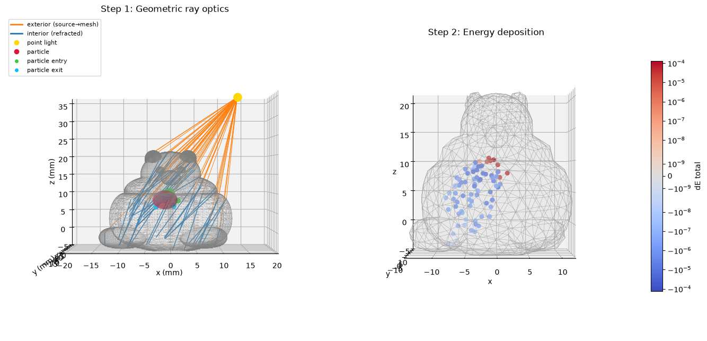

### Step 3 Energy diffusion and Step 4 camera anomaly

Left: Step 3 — Energy diffusion. The simulation solves the steady-state, isotropic diffusion of light intensity from the volumetric sources defined in Step 2, showing how optical fluence differential is spread from the particle and its shadow across the gummybear phantom. Tet centroids are colored by the fluence delta $\Delta\Phi = \Phi^{\mathrm{particle}}-\Phi^{\mathrm{background}}$.

Right: Step 4 — Image collection. The pipeline simulates a pinhole camera by inverse ray-tracing from the camera to first-line surface hits on the surface mesh. At the hit points, it samples optical flux attributable to the particle presence as $\Delta\Phi$. The intensity scale shows **per-image z-score** normalisation, corresponding to the input to ML.

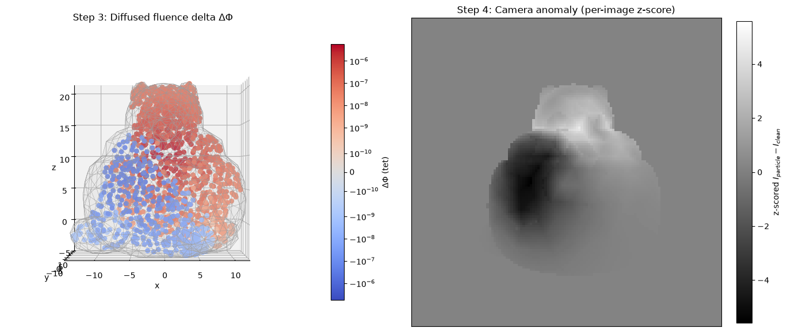

### Limitations of the optical simulation pipeline

The optics pipeline is a compromise between realism and simplification for speed and developement feasibility. Major limitations are:
- Single refraction: At most 1 refraction event is taken into account per light source ray
- Diffuse imaging only: Although the gummybear optics python package handles both diffusive and direct ray-based energy transport to the camera, only diffuse parts are considered here for particle localization. The diffuse part is the major contribution in translucent, highly scattering media of interests here.
- Single particle only: Already mentioned above, the simulation itself handles multipe, non-overlapping particles. For the scientific question of the utility of a Fourier aggregation layer for particle localization, the simpler single-particle scenario offers a clearer hypothesis testing path. 
- Optical simplifications. The major technical simplication at the level of the physics are:
  - Ballistic transport vs. Isotropic diffusion only (e.g. scaler representatio of diffuse intensity, not angle-resolved). Partial anisotropic transport, secondary reflected or scattered rays are not considered. 
  - Stationnary solution of the diffusion equation (no time-of-flight analysis)
  - Refraction only: This simulation is based on non-coherent optics, no constructive / destructive interference, Fresnel, Newton rings etc.
  - Pinhole camera without explicit lense effects.

Summarizing, a series of deliberate optical and design limitations were made. These simplify optical simulation considerably, enabling the generation of a clearly structured data body with:
- key label: particle position; 
- meta-data or feature depending on the experiment: camera position, lighting position. 
Also, the simplification and aggressive cashing permitted to simulate a large body (hundreds to thousands of particle configurations, tens of thousands of individual views) on my personal machine in a reasonable time frame. 

The simplifications were explicitly made with a translucent, non-specular, non-coherent image mode that nevertheless produces interpretable optical signal for the particle localization elements. The one less intuitive element that was necessary in the simulation was the Robin boundary length to capture the fact the diffusive radiation captured transiently in the gummybear contributes significantly to the realistic aspect of a translucent object partially illuminated by the scattered energy (in the manner of a translucent lightbulb).

Consequently, conclusions drawn from this study should be interpreted in the context of the simulated regime considered here: translucent media, single-particle localization, non-coherent optics, and diffusion-dominated image formation. The primary focus of the study is the utility of spatial-frequency representations for localization under information-limited conditions rather than the exact realism of the optical simulator. While transfer learning to real-world images is planned as a future development direction, doing so introduces a second set of scientific questions related to simulation fidelity, domain transfer, and model generalization. These questions are distinct from the primary hypothesis tested in this project and are therefore left for future work.

# 4. Dataset Generation and Quality Assurance

## Project Implementation

Given the complexity of the combined task of optical simulation, dataset generation, and dataset consumption for testing the project hypothesis in machine learning, the project was planned an implemented as a series of practical progression steps.

| Project Step | Milestone | Dataset | Python Package |
|---|---|---|---|
| Optical simulation framework | M1-M5 | No ML dataset produced. These stages establish the physical and geometric simulation capability used later for dataset generation. | `gummybear`, `gummybear_validation` |
| Dataset-generation capability | M6-M7 | No final ML dataset produced. These stages develop the configurable workbook-driven generation pipeline, caching logic, and reusable data-generation infrastructure. | `gummybear`, `gummybear_validation`, `tomography_ml`, `tomography_ml_validation`|
| Single-view localization | M8 | **M8 fixed illumination dataset**. Single-particle localization under fixed illumination and multiple optical regimes. The corpus retains a camera orbit; M8 ML consumes a single fixed camera angle (180°). | `gummybear`, `tomography_ml`, (helpers from `tomography_ml_validation`) |
| Multi-view camera fusion | M9 | Reuses the M8 single-illumination dataset. The dataset is unchanged; the experiment uses multiple camera views to be consumed by the model. | `tomography_ml` (with M8 dataset) |
| Multi-illumination fusion | M10 | **M10 multi-illumination dataset**. Particle placements are simulated under multiple illumination directions for illumination-fusion experiments. | `gummybear`, `tomography_ml`, (helpers from `tomography_ml_validation`) |

The project was developed incrementally. M1-M5 establish the optical simulation framework, while M6-M7 extend this framework into a configurable dataset-generation capability. The resulting infrastructure is then used for the machine-learning experiments in M8-M10. Importantly, not every milestone produces a separate dataset: M9 reuses the M8 dataset and changes only the model input strategy.

## Implementation Scope Boundaries


### Software Project Boundary

This project treats foundational scientific-computing libraries such as PyTorch, Netgen, NGSolve, NumPy, and their dependencies as trusted infrastructure components.

Project-specific work therefore focuses on the selection, configuration,
parameterization, combination, and evaluation of these components rather
than reimplementation of their internal algorithms. Examples include the
choice of neural-network architectures and optimizers in PyTorch, mesh
generation strategies in Netgen, and finite-element spaces and solver
configuration in NGSolve.

My contribution is the creative use of existing building blocks, not the re-implementation or verification of their inner workings.

### AI Tool Usage Boundary

My stance on AI tool usage is simple: the questions, hypotheses, architecture ideas, modeling decisions, experimental design, debugging direction, and evaluation logic are mine. Also I implement core concepts manually to develop intuition and deep understanding. However, once that foundation exists, AI helps explore the implementation space faster. I decide where the project goes.


This project followed this stance:

The optical simulation concepts (M1-M5), dataset design (M6-M7, with later expansion in M8 and M10), dataset lazy-loading from catalogs, machine-learning fundamentals in the form of initial CNN/Fourier-pooling experiments, model heads, Euclidian loss function, training loops, evaluation strategy, elementary analysis and plotting were developed manually using public documentation, scientific literature, and notebook-first experimentation. The intent was to build precise understanding of the core simulation and machine learning mechanisms.

AI-assisted tooling was used as the project grew in size and complexity. OpenCode was used for planning support, while OpenCode and Cursor were used increasingly for implementation assistance. This support was mainly applied to software-engineering tasks such as refactoring, boilerplate generation, reusable package structure, caching, parallel execution, flexibilization of dataset derivation, and reduction of code duplication across related model and pipeline variants.

All AI-assisted code was reviewed, tested, and integrated manually. Scientific assumptions, simulation parameters, dataset definitions, model choices, and experimental conclusions are mine.

## Dataset Generation and Validity

### Dataset Generation: Standard Approach

For this project, dataset generation and shaping is performed in 4 steps:
- Step 1: **Configuration**. Creation of an Excel-based configuration file (scene, illumination, particle, camera orbit settings). A sequence corresponds to a set of views visible from an orbit of predefined camera positions, looking at a single gummybear scene with a single defined illumination source, single defined particle. This includes randomizations.
- Step 2: **Optical simulation**. Carried out sequence per sequence (optionally, parallel processing). Write images and manifests to disk, organized in per-sequence folders.
- Step 3: **Catalog**. Before use, reload Excel file as catalog for on-disk data, 1 row per sequence
- Step 4: **Dataset**. Instantiate dataset for PyTorch indexing according to ```x,y = dataset[i]``` Samples (indexed by $i$), features($x$) and labels($y$) are defined per task, see below.


The datasets are then ready for use with DataLoaders for ML pipelines.

Note that configuring Optical Simulation in Excel is a specific architectural choice, aiming at separating data generation from the code base. Loading a catalog before instantiating a dataset provides flexibility regarding the choice of features and labels for reusability in tasks beyond this project. For example, in this project, particle position is generally treated as a label (prediction target), while image data constitutes a feature used for prediction. The same dataset could equally support the corresponding forward problem, in which particle position serves as the feature(input) and image data as the label (prediction target).

As outlined already above, two datasets are produced:
- **M8 fixed illumination** Dataset: Fixed illumination, variable camera, random particle positions. Also contains 3 different gummybear optical property sets.
- **M10 variable illumination** Datset: Variable illumination, variable camera, random particle position, fixed gummybear properties.

The different datasets are obtained using the same four-step pipeline. The primary differences are the experiment configuration defined in Step 1 and the task-specific dataset and tensor representations used in Step 4.


### M8 - Fixed Illumination Dataset

For reproducible execution, see the notebook [Open the main notebook](GummyBearTomography_Final_Report.ipynb). Here, in this summary document, onle the figures are reported.

The dataset are made available as PyTorch compatible objects respecting the indexation contract 
```python
[x,y]=dataset[i]
```

#### Sample definition in M8 and M9

<table>
<tr>
<td align="center" valign="top">

**M8 single view**

M8 (1, 1, 128, 128); V=1 (still), C=1 (greyscale)

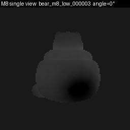

</td>
<td align="center" valign="top">

**M9 multiple views**

M9 (36, 1, 128, 128); V=36 (orbit), C=1 (greyscale)

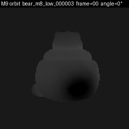

</td>
</tr>
</table>


In M8 a sample is an image represented by a [V=1,C=1,H=128,W=128] tensor, the leading two dimensions being singletons (single view, grayscale). A sample in M9 is an ordered sequence of angular views, and is represented by a [V>1,C=1,H=128,W=128] tensor. V=10 in demo and inspection mode, and V=36 in full mode. The image data is raw float as negative and positive deviations from background are recorded. **Physically, a sample** in M8 and M9 corresponds to the set of camera views acquired for a single particle placed at known xyz position in the gummybear; in M8 one view is used, in M9 all available views are used. In general, the image tensor is provided in the feature data, and the position $x,y,z$ or in some steps only one position such as $z$ is the label.


### M10 - Multi-illumination Dataset

M10 extends the M8/M9 sample geometry with a revolving point light. On disk, each sequence is still one (particle, illumination) pair with a camera orbit. 

#### Sample definition in M10

For ML, the joint unit uses the canonical **illumination-major** layout:

```text
[I, V, C, H, W]
I = illuminations (lights)
V = camera views
C = channels (1 = greyscale)
H, W = image height, width
```

**M10 multi-view, multi-illumination**

M10 sample (6, 36, 1, 128, 128) = [I,V,C,H,W]  GIF sweeps 216 frames @ 10 fps

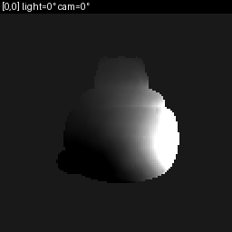


### Dataset Validity

#### Dataset gathering

The dataset is fully synthetic and generated through a custom optical tomography simulation pipeline. For each sample, particle positions and optical simulation parameters are drawn from predefined random seeds, optical propagation is simulated, and multi-view images are generated. The complete generation process is therefore reproducible from the stored configuration and deterministic in terms of known, registered random seeds for particle positions and train/val/test split.

#### Statistical validity

Statistical independence between train, validation, and test partitions is enforced at the particle level. Samples are assigned to a split using a dedicated split randomization seed, while particle placement uses separate randomization seeds. This separation ensures that train/validation/test assignment is independent of particle generation. The per-particle assignment prevents data leakage between partitions including in multi-view and multi-illumination settings.

Train/validation/test assignments are generated once during dataset definition, recorded in the dataset configuration, and remain fixed throughout all experiments. Consequently, model evaluation is always performed on a predefined partitioning established before any training or analysis is conducted. This avoids inadvertent bias from repeated split selection and ensures that all model comparisons are evaluated on identical data partitions.

#### Data Cleaning

No generated samples were discarded during dataset creation. This includes difficult or low-information cases, such as configurations in which particle visibility is reduced (or in rare cases, null) by the optical geometry. Retaining all generated samples avoids introducing selection bias and provides a more representative evaluation of model performance.

No manual cleaning or sample selection was performed.

#### Data manipulation
Generated images are transformed into ML-ready tensors as outlined above. Prior to entering the machine learning pipeline, they are normalized using per-view z-score normalization (see below).

#### Data integrity

To ensure consistency between image data and associated metadata, a hash derived from the generation conditions is compared against a corresponding hash stored in the sequence manifest. This validation step helps detect accidental mismatches between generated images and their labels before dataset construction.

# 5. Deep learning

## Core Network architecture

The aim of this project is to evaluate utility of Fourier-type modulation of encodings for spatial localization from camera views of particle signal in a translucent gummybear phantom.

This section shows the bare-minimum prediction pass in direct PyTorch. Packaged variants used in the M8–M10 studies live in `tomography_ml`. The canonical network is:

- 3-layer CNN image trunk
- Fourier pooling
- Small MLP projecting to predicted coordinates

In the main [GummyBearTomography_Final_Report.ipynb](GummyBearTomography_Final_Report.ipynb), a hard-coded minimal example of the architecture can found, including optimizer setup (Adam) and an example training step. 

The loss function used throughout this porject is mean squared error MSE as this reflects the nature of Euclidian geometry when trying to localize particles in 3D space. Parameter count is discussed as fit as an additional measure with possible mobile or embedded deployment in mind.

## M8. Milestone M8: Single-view localization studies

Three spatial-readout architectures share the same CNN trunk and differ only in how spatial information is read out:

| Variant | Readout | Path |
|---|---|---|
| **pooled** | zero-order | CNN → global avg pool → Linear → targets |
| **fourier** | fixed low-frequency | CNN → Fourier-coded pool → Linear → targets |
| **flatten** | full learned | CNN → Flatten → MLP → targets |

**Protocol:**

1. **Learning-rate study on `particle_z` only** (geometrically most evident axis, from feet to head) — illustrative LR grid; reported runs use historical canonical LRs per architecture.
2. **Full train → validation / test on `particle_z`.** This directly compares the architectures to each other in the clearest setting (geometrically most distinct axis)
3. **Full train → validation / test on `(particle_x, particle_y, particle_z)`.** Challenge in a richer prediction setting
4. **Split sensitivity on xyz:** repeat step 3 for re-randomized train/validation/test splits. This permits to understand the robustness of the result in the face of train/val/test re-randomization. Sensitivity only: Primary split used in steps 1-3 is authoritative.

**Input:** Particle-attributable signal (no noise or artificial image corruption), single view at 180° (`keep_angles_deg=180`). z-score normalization per image including in image series to maximimze contrast: The aim is to assess architecture, not robustness to poor image quality.


### M8 Study setup

### M8 Step 1: Learning-rate study

For each architecture, train on the full training split over a learning-rate grid (curves below). Reported subsequent runs use historical canonical LRs rather than the grid argmin. Study on foot to head axis, which is geometrically cleanest. No evaluation on test split. In this step, no scientific conclusions are drawn.

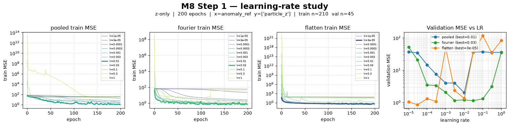

### M8 Step 2. z-axis localization study. Train → validation / test on `particle_z`

Test of Fourier vs. Pooling layers, with Flattened as full embedding retention control. Restricted to the z-axis. Each architecture is trained on the full training split with the historical canonical LR for that architecture, then evaluated on validation and test.

This step answers the question of the performance of the Fourier layer with respect to GAP pooling (spatial averaging) and flatten (full embedding retention) in the simplified task of z-position estimation (foot-head coordinate). The design of the study means that performance evaluation is interpreted for this particular dataset and split; some training variability is taken into account by evaluation over 3 repeated training runs.

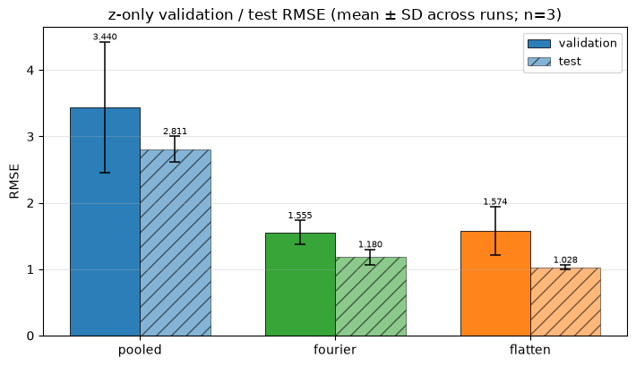

### M8 Step 3 Train → validation / test on `(x, y, z)`

Repeat the full train → val/test comparison with three-dimensional targets, reusing the historical canonical learning rates. Again, no loss-vs-epoch overlay — only held-out RMSE summaries. Full 3D target leads to higher RMSE losses (three coordinates) and could potentially be more variable.

This step answers the question of whether the performance advantage of the Fourier layer with relative to pooling, approaching flattening, extends to the task of 3D position estimation. Again, the design of the study means that performance evaluation is interpreted for this particular dataset and split; some training variability is taken into account by evaluation over 3 repeated training runs.

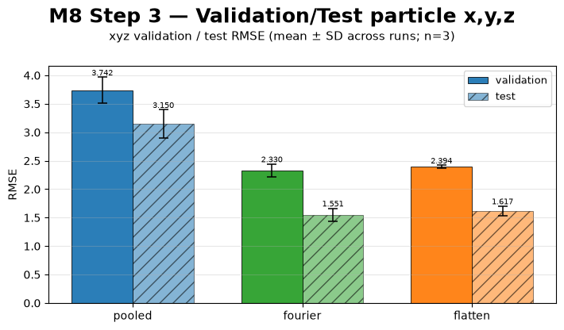

### M8 Step 4. Split sensitivity on `(x, y, z)`

Repeat the xyz train → validation / test protocol for `N_SENSITIVITY` independent particle-level splits (`SENSITIVITY_SPLIT_SEEDS`, default 60–64). Each split uses **one** training run (fixed training seed), so the spread reflects split variability rather than optimizer seeding. Catalog rows are relabeled in memory; the live workbook split is left unchanged.

This step answers the question of whether the performance advantage of the Fourier layer with relative to pooling, approaching flattening, can be generalized in the face of possible split randomization variability. The design of the study still means that the conclusion applies to this particular M8/M9 dataset, but that at least is not unique to the default split.

In terms of study design, step 2 and 3 are authoritative because the use the main, predefined split, this step is supportive as split is re-randomized.

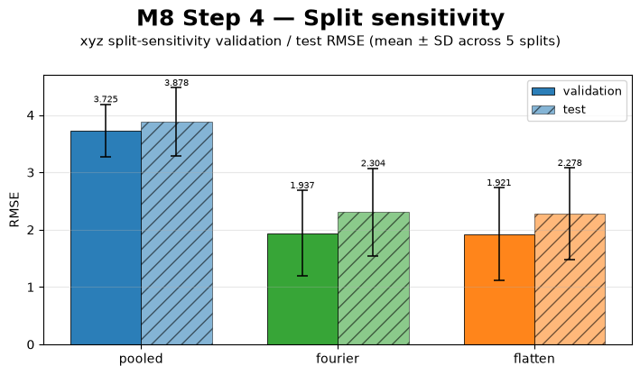

### Concusions from M8

- Average pooling performs worse than the other architectures, in z-localization and in 3D localization. Fourier performs substantially better, and usually (dependent on experimental fluctuations from run to run), Flatten performs best.
- This is interpreted to be related to Fourier-coded pooling and Flatten both preserving spatial information and achieving much lower validation / test error on both z and on xyz. Although not proof of the project hypothesis (you can never prove exactly a hypothesis) it supports the project hypothesis.
- It is also noteworthy that Fourier achieves comparable held-out performance with orders of magnitude fewer learned parameters (32k vs. 134M, e.g. a factor of about 4000).
- The split-sensitivity panel reports how those xyz conclusions hold under `N_SENSITIVITY` independent particle-level train/val/test partitions (one training seed each - only the partition is independent, the datast is the same).

The split sensitivity analysis merits particular discussion.

The dataset intentionally includes particle locations spanning a wide range of localization difficulty, including near-null observations and multiple optical turbidity regimes. Because train, validation, and test partitions are randomized at the particle level, different partitions may contain different proportions of these difficult cases. This likely contributes to the observed variation in absolute RMSE between splits.

Despite this challenge, the qualitative architecture ranking was stable across the examined splits. Global average pooling consistently produced the highest error, while Fourier-coded and flatten-based readouts remained substantially better. Thus, although the absolute performance estimates vary with split composition, sometimes to a considerable degree, the central conclusion is robust: 

**The chosen method of preserving spatial information in the readout improves localization performance on single views.**

## Multi-view localization (M9)

The next step is to assess the benefit of the Fourier pooling layer in the context of view fusion for particle localization.

M8 established utility of Fourier encoding in a small network configuration for the analysis of single camera view.

M9 analyses whether Fourier encodings would be similarly useful in a multiview setting. Specifically, the views of a camera orbit around the Gummybear are analysed jointly.

The primary interest is to see whether the advantage of Fourier pooling over GAP (global average pooling) is conserved.

| Post-CNN pooling | Description |
|-------|-------------|
| GAP | Per channel, the feature map is averaged |
| Fourier| Per channel, the feature map is multiplied element-wise by Fourier terms, and averaged |

In order to understand generalizability, GAP vs. Fourier is tested in ladder of view embedding fusion methods with increasing complexity:

| View fusion method | Description |
|-------|-------------|
| single-view ref | Take embedding of the fixed 180° camera view (or mid-orbit if 180° absent), MLP to xyz |
| xyz-mean| MLP to xyz for every view, average x,y,z values |
| mean-pool| Average embeddings over views, then fusion MLP to x,y,z values |
| "DeepSets"| Permutation invariant fusion MLP: Linear(+ReLU) -> average -> MLP to x,y,z values |
| ordered-concat | Concatenate all embeddings, then fusion MLP to x,y,z values |

The idea here is to understand whether increased sophistication of the fusion layer interacts with the Fourier encoding, for example, making them more or less advantageous over GAP.

**Outputs shown:** Learning rate study (if performed or available from disk), val and test comparison of Fourier vs. GAP across the fusion methods.

**Training regime:** We also specifically compare separate training of CNN and fusion heads vs. joint end-to-end training. Indeed, end-to-end training might permit back-propagating gradients from the MLP to condition CNN to better exploit spatial information or better provide suitable Fourier embeddings, altering the balance between Fourier and GAP.

Approach:

| Step | Description |
|-------|-------------|
| Step 1 | Sequential scheme: Train encoder, then Fusion heads with frozen encoder | Fourier vs. Pooling on 5 fusion architecture variants |
| Step 2| End-to-end training of the full network. |

Note: The reason to include a "DeepSet" inspired architecture is that DeepSets ([[Zaheer et al., 2017]](https://arxiv.org/abs/1703.06114)) is consideted a powerful middleground solution for image fusion while maintaining the process order agnostic.


### M9 dataflow

The diagram below shows the dataflow in M9. The input views are from the common M8/M9 optical simulation dataset.


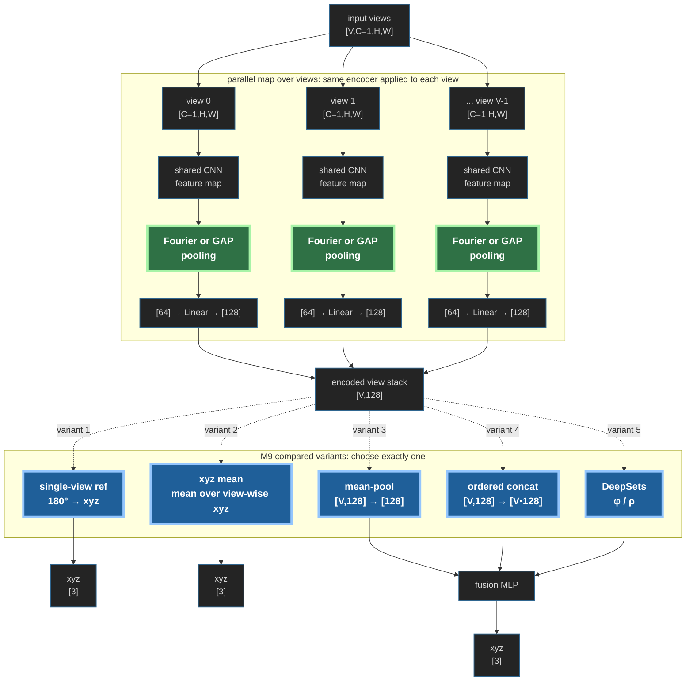


### M9 step 1 results

M9 permits to address the question of whether the advantage of the Fourier-modulated embeddings observed in M8 persist across multi-view fusion. The design of the study means that this answer is limited to the case of the use of separately trained encoder and fusion heads. In particular, the xyz-averaging method is realistic when localization estimations form different views are collected and later pooled arithmetically.

Note that the architectures here use the historical Stage-B learning-rate defaults (illustrative LR sweeps are not used to select reported runs).

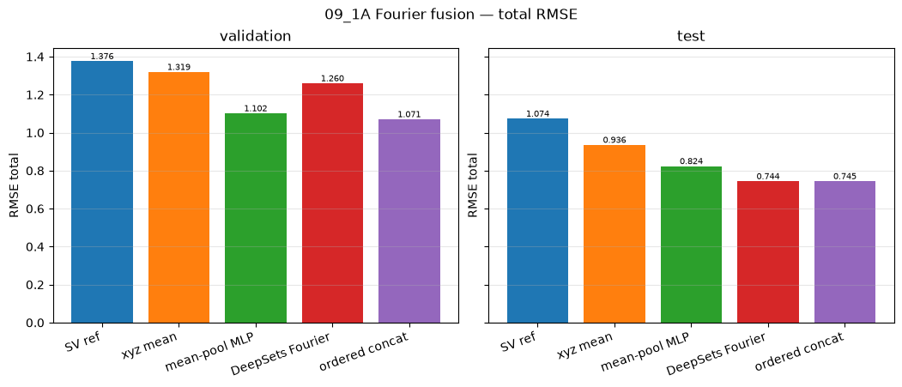

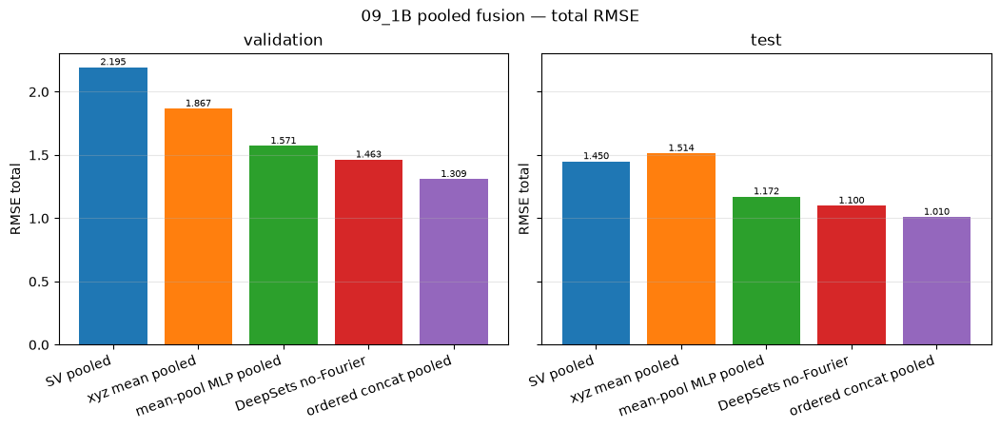

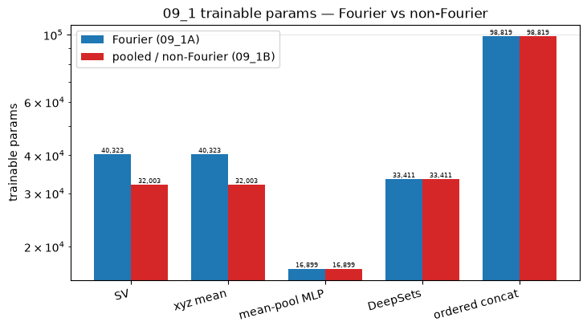

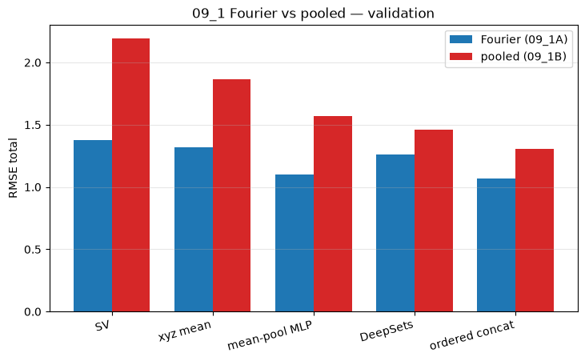

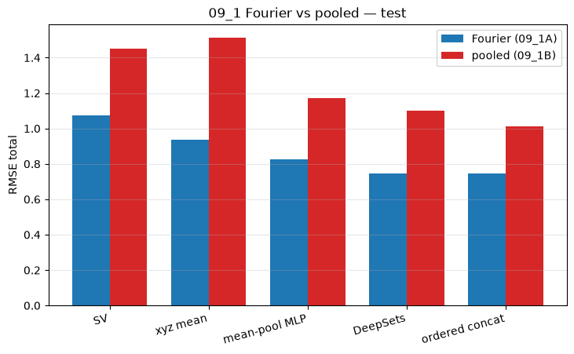

### Interpretation of M9 Step 1

- For the 2-step approach with a trained, then frozen encoder and a separately trained fusion head, the advantage of the Fourier embeddings persist across view fusion.
- However, the advantage decreases with incrasing fusion head complexity. Apparently, a more complex fusion head permits to at least partially compensate for relative lack of spatial information in the embeddings.
- Note that the ladder confirms an advantage of the learned DeepSet-inspired fusion layer over simple pooling, in line with literature expections. Fourier-encoding, in the particular setting of two-stage learning, provides an additional more minor advantage in the DeepSet setting.

### M9 Step 2: end-to-end geometry fusion

The aim here is to understand whether gradient descent into the CNN part in end to end learning helps to instruct the network to encode spatial information in ways independent or in competition with Fourier embeddings.

The network architectures compared are simplified and slightly adapated to the this specific question:

| Fusion Head | Description |
| ----------- | ----------- |
| Single view | As in Step 1; not learned |
| xyz averaging | As in Step 1; not learned |
| Compact Head | 128-embedding, 1 Linear/ReLU block then project |
| Large Head | 512-embedding, 2 Linear/ReLU block then project |

Comparing a similarly constructed, but more or less expressive fusion head provides a simple measure on the impact of gradient descent in end to end training.


#### M9 Step 2: Results
Comparison of Fourier vs. Pooling on validation and test split loss after end to end-training.

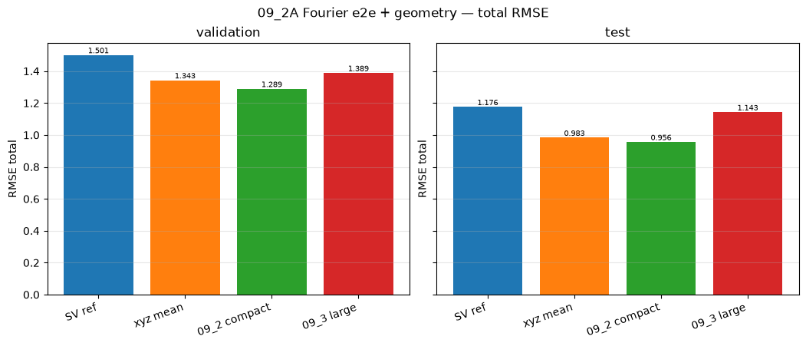

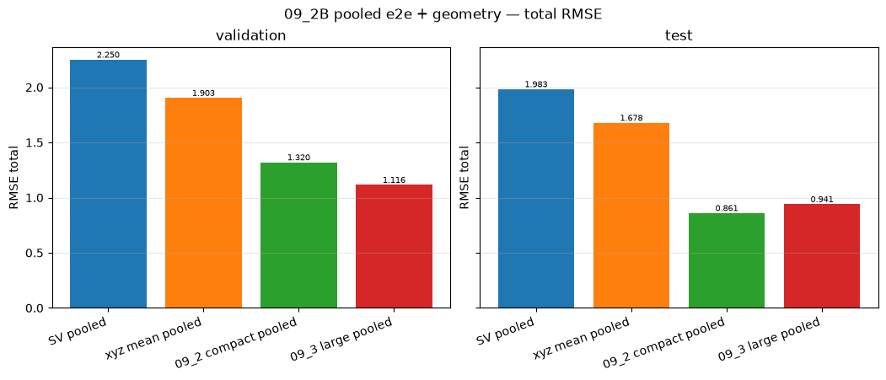

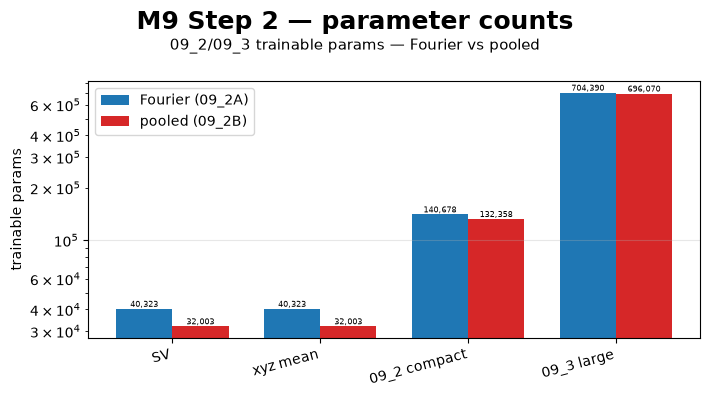

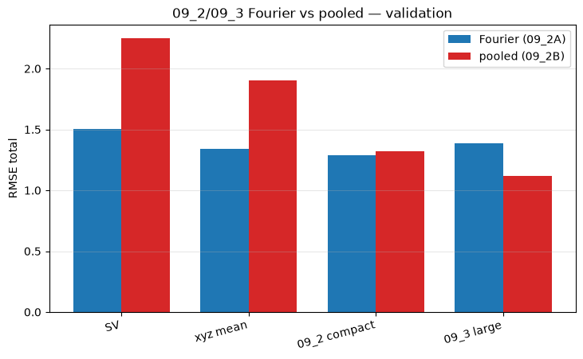

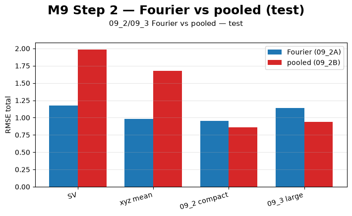

#### Interpretation M9 step 2

- End-to-end training abolishes the beneficial effect of Fourier encoding in the multi-view camera setting. 
- The advantage is still seen on the single view and xyz-mean controls which do not have a trainable fusion head. Therefore, the conclusion is specific to the use of fusion heads.
- This comes with substantially larger models (albeit still moderate by modern standards)
- Scientifically, a plausible interpretation is that the gradient descent provides the CNN with the opportunity to encode information in the embeddings that are "re-traceable" by the downstream, powerful MLP. 
- Fourier-modulated embeddings might even somewhat harmful. Possibly the higher frequency content modulation adds noise, possibly the gradient descents is able to find better encodings, possibly the small non-inferiority of the Fourier approach seen in the test split is statistical noise. Further analysis and experiment repetition would be needed to better understand this.

## Multi-illumination localization (M10)

M10 adds illumination as a source of physical information variation.

Compared to the addition of views, the addition of various illumination angles adds a majour soure of physical information: while camera views essentially complete the "hidden face" of a given gummybear physics, revolving the illumination source around the bear permits the particle to cast a revoving shadow and scatter halo in the gummybear.

The question for M10 is however the same as for M9: Does the advantage of Fourier embedding pooling survive through fusion of information from different views?

Based on the M9 results (which were not available at overall project design time, but are available at write-up): The question becomes rather whether illumination adds enough additional information so that Fourier embedding becomes unnecessary or harmful even the case of two step training between encoding and fusion.

| Protocol | Training | Fusion head variant |
|----------|----------|---------------------|
| Step 1 | Frozen: CNN Encoder, Fusion MLP separately | single-illumination / mean-xyz controls; compact ordered-concat heads C (no light angle) and D (same capacity, light-angle FiLM) |
| Step 2 | End-to-End: CNN Encoder and Fusion MLP jointly | same A–D ladder as Step 1 (C and D share compact capacity; D adds light-angle conditioning) |
| Step 3 | Hierarchical fusion: Illumination, then camera views | One defined fusion strategy, evaluated for Fourier and pooled: CNN per view (one illumination, one camera angle) -> MLP fuses illumination, using cos/sin illumination angle token -> MLP fuses camera views -> xyz |

Reported runs use historical / default learning rates rather than per-model optimal selection from LR sweeps.

### M10 Step 1 - separate encoder and illumination fusion training
#### Setup


### M10 Step 1 - Single Camera View, Multi-illumination, Separate Encoder and Fusion Head Training
####Results: Learning rates, val/test performance, model size, Fourier vs. Pooled comparison

The models compared are:

- A Evaluation from illumination 0° at camera 180° per particle (xyz): "Single View reference"
- B Evaluation as the average of the xyz positions across all the illumination views "xyz mean"
- C Illumination fusion head (per illumination: CNN -> Fourier/GAP -> 64 -> Linear -> 128 concat I illumination embedding -> MLP (Linear 128*I -> 128, Relu, then Linear to xyz) -> 3), no illumination angle input
- D Same compact capacity as C, but with explicit light-angle conditioning (FiLM on the 128-d latents after encode, using cos(angle) and sin(angle))

Fourier vs. Pooled indicates utility of Four layer in each of these architectures. The reason for including explicit angle as learned feature-wise linear transformation (FiLM) is to understand whether the model needs explicit angular information or whether illumination cues and ordering are sufficient. 

Also note that while A is evaluated on a single view (illumination 0°, camera 180° per sample), training is on all illumination samples concatenated, that is the physical instruction offered by the multi-illumination setting enters the model training.

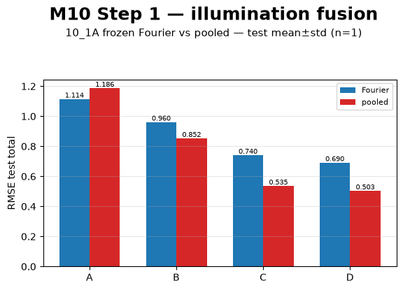

### M10 Step 1: Conclusions

- Fourier encoding remains useful, by a small margin, on single view evaluation (Model A).
- The fact that the margin is much smaller than in M8 or M9 with separate training is very interesting.
- For the more more complex fusion heads, and in fact even for simple xyz averaging, Fourier performs less well than the other models.
- In terms of fusion heads, the angle-aware head D seems slightly more performant than the angle-unaware head C at the same compact capacity.
- The conclusion is that Fourier is clearly not uniformly better: it remains a useful augmentation in the information-scarce single-view setting (Model A), but not when richer multi-illumination information is available for fusion.


### M10 Step 2 end-to-end illumination fusion (10_1B)

The question is here whether end-to-end training has a further impact on the relative performance of Fourier and GAP post-CNN pooling.

The A–D model ladder, but trained end-to-end was used.

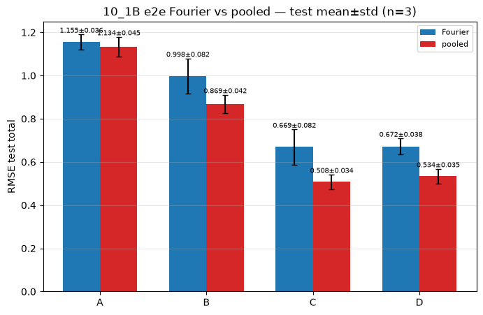

### M10 Step 2: Conclusions

The conclusion of step 2 (end-to-end training, N=3 repeat of the training) is that Fourier embedding is not advantageous, and in fact slightly detrimental on the fusion heads, confirming M10 Step 1 for the multi-illumination setting.


### M10 Step 3: Hierarchical light-then-camera fusion

Factorized fusion was originally planned in the project but could not be completed due to long executions and lack of time.


### Software verification

The repository unit-test suite (`pytest`) checks catalog contracts, workbook randomization, and ML dataset loading used throughout this report. The cell below runs that suite against the same installed packages and local CAD/config assets as the notebook environment.


# Overall project conclusion

This project investigated whether physically informed Fourier-based spatial representations can improve particle localisation in translucent media while maintaining low model complexity. To address this question, a complete synthetic optical tomography framework was developed, enabling controlled evaluation of localisation architectures under single-view, multi-view, and multi-illumination conditions.

The results show that preserving spatial information is critical for accurate localisation. The single-view setting (M8), characterized as being relatively information-scarce due to absence of both illumination and view angle variation, Fourier pooling substantially outperformed Global Average Pooling while using orders of magnitude fewer parameters than flatten-based approaches. This effect remained valid multiple train/validation/test partitions, the exact error varied with split composition, but the overall ranking remained stable: architectures that preserved spatial information consistently performed better than aggressive spatial averaging.

At the same time, the benefit of Fourier representations was not universal. In multi-view (M9) and multi-illumination (M10) experiments, their advantage decreased as additional observations and more expressive fusion models became available. Under end-to-end training, Fourier pooling often became neutral or slightly detrimental, suggesting that sufficiently powerful networks can learn alternative spatial encodings directly from the data.

The project hypothesis is essentially supported but augmented. Fourier-inspired spatial representations provide a valuable and highly parameter-efficient way to preserve localisation information when observations are limited. Their usefulness decreases as physical information content and model capacity increase. A learning was also that the Fourier terms, which were beneficial or highly beneficial at low parameter count, were also somewhat harmful for larger models with richer information access. Presumably, it is preferrable for the model to shape the embedding in its own way in these richer cases, the Fourier representation may add information limits or undesirable representation biais.

Beyond the specific machine-learning results, the project demonstrates a reproducible framework combining optical simulation, synthetic dataset generation, and deep-learning evaluation. Future work should investigate more realistic optical conditions, multi-particle scenarios, hierarchical fusion methods, and possibly transfer learning from simulation to experimental data. Hierarchical light-then-camera fusion (M10 Step 3) could also eventually be completed but a priori, no fundamentally new result is anticipated.

In summary, the central finding of this work is that explicit preservation of spatial information with Fourier embedding multipliers improves localisation performance under information-constrained conditions, while richer observations progressively reduce the need for handcrafted spatial-frequency priors.
