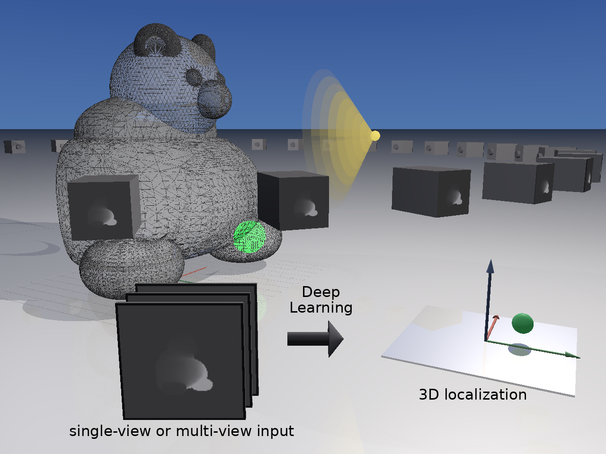
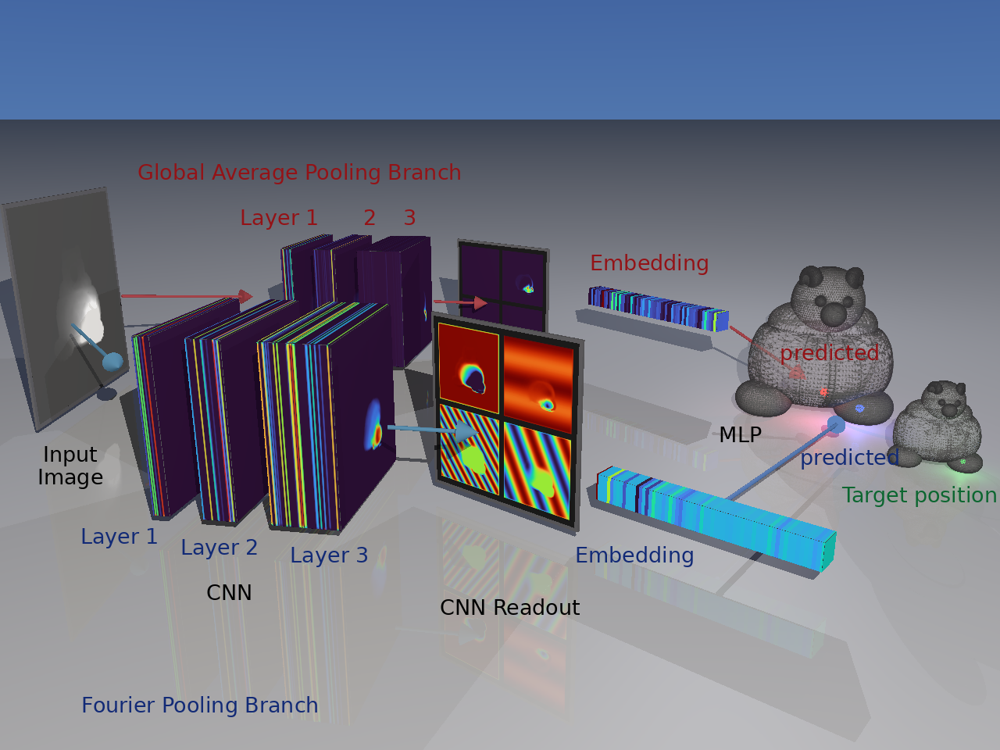

# gummybear-tomography
Position localiser for gummy bears

## Physical Setting

The physical problem underlying the gummybear tomography project is the reconstruction of 3D localization from single or multiple views of a translucent gummybear phantom containing localized particles.

<p align="center">
  
</p>

The figure illustrates the complete workflow: synthetic optical acquisition of a meshed phantom, generation of one or multiple projection images, deep learning-based inference, and 3D localization of embedded particles. 

## Deep Learning Architecture

Deep learning is used to compare architectures with and without a Fourier representation layer:
- Single or multiple image views form the input of a Convoluted Neural Network CNN
- The CNN consists of three consecutive layers with increasing channel depth and constant image size
- The CNN is read out in different ways. The main theme of the project is the impact of applying Fourier wave terms before pooling after the CNN. The main, but not the only, comparison arm is pooling without such Fourier terms.
- After pooling, a small MLP head projects to 3D xyz positions; the readout is precision of the xyz prediction as compared with the known xyz position used for simulation.

<p align="center">
  
</p>

The figure illustrates the deep learning problem and approach: From a synthetic gummybear image, a deep machine learning model is trained on the synthetic data in order to be able to predict positions from single or multiple views of the Gummybear. The figure shows activations acquired during predictio operations and comparitive prediction of positions on the two branches (Fourier and Average Pooling).


The final report is at [GummyBearTomography_Summary.md](GummyBearTomography_Summary.md)


Complete reproduction of the calculations can be obtained through execution of the full Jupyter notebook:

 [GummyBearTomography_Final_Report.ipynb](GummyBearTomography_Final_Report.ipynb)
 
 
Full executions are about 12-24h of calculation time (Silicon M2, Metal acceleration). However, checkpoints and also the generated optical model output is available from https://huggingface.co/datasets/tbhugging/gummybear-tomography


The filestructure should after download should be


```text
gummybear-tomography/
├── checkpoints/                          # full-mode ML study I/O only (DATA_MODE=full)
│   ├── m8/
│   │   ├── m08_learning_rate_study.pt
│   │   ├── m08_train_val_test_z.pt
│   │   ├── m08_train_val_test_xyz.pt
│   │   ├── m08_xyz_split_sensitivity.pt
│   │   ├── m08_train_val_test_xyz_comparison.csv   # example sidecar
│   │   └── split_seed_60/                          # example per-split folder
│   │       └── session_summary.csv
│   ├── m9/
│   │   ├── m09_frozen_fourier_fusion.pt
│   │   ├── m09_frozen_pooled_fusion.pt
│   │   ├── m09_e2e_fourier_geometry_fusion.pt
│   │   └── m09_e2e_pooled_geometry_fusion.pt
│   └── m10/
│       ├── m10_frozen_illumination_fusion.pt
│       ├── m10_e2e_illumination_fusion.pt
│       ├── m10_hierarchical_light_then_camera.pt   # 10_2 (when trained)
│       └── m10_1a_comparison.csv                   # example sidecar
│
└── data/
    └── generated/                        # optical corpora (not ML weight store in full mode)
        │
        ├── m8_1/                         # full M8/M9 single-particle corpus root
        │   └── single_particle/
        │       ├── bear_m8_high_000001/
        │       │   ├── manifest.json
        │       │   ├── anomaly/
        │       │   ├── clean/
        │       │   ├── observed/
        │       │   └── particle/
        │       ├── bear_m8_med_…
        │       ├── bear_m8_low_…
        │       └── _cache/
        │
        │
        └── m10_illumination/             # full M10 illumination corpus
            ├── bear_m10_000_000001/
            │   ├── manifest.json
            │   ├── anomaly/
            │   │   └── …_frame_0000_angle_+0000.00.raw.tif
            │   ├── clean/
            │   ├── observed/
            │   └── particle/
            ├── bear_m10_060_…
            ├── bear_m10_120_…
            └── …
```

Note that in the Huggingface repository, the m8_1 and m10_illumination folders are zipped, you will need to dezip them if you want to use this as a basis for a full run evaluation.


There is also a demo mode in the workbook, but this merely tests execution capacity, no scientific conclusions can be drawn from this.


